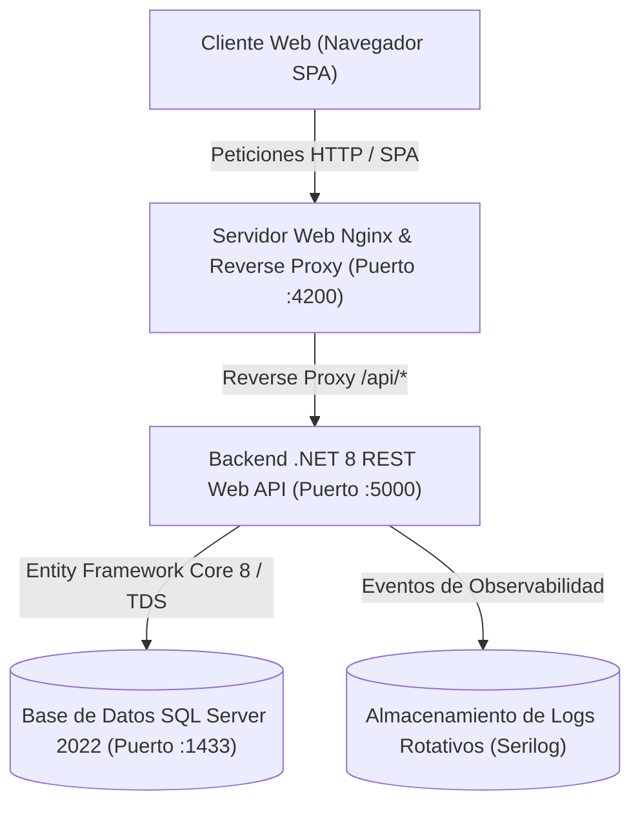

# Especificación de Arquitectura, Patrones de Diseño y Tecnologías

**Sistema de Gestión de Inventario, Productos y Control de Acceso**  
**Proyecto:** Prueba Técnica Backend / Full-Stack  
**Stack Tecnológico:** Angular 18 | C# .NET 8 Web API | Entity Framework Core 8 | Microsoft SQL Server 2022 | Docker | Serilog

---

## 1. Diagrama de Arquitectura Global

El sistema se estructura bajo una **Arquitectura en 3 Capas Desacopladas (*3-Tier Architecture*)**, orquestada de forma aislada mediante contenedores Docker y proxy inverso:



---

## 2. Cumplimiento de Requerimientos Técnicos

### 2.1. Frontend Desarrollado con Angular 18
* **Componentes Standalone**: No se utilizan módulos `NgModule`. Cada vista y componente es autosuficiente, reduciendo el peso final del bundle y facilitando el mantenimiento.
* **Angular Signals**: Gestión del estado reactivo mediante `signal()`, `computed()` y `effect()`, reemplazando suscripciones manuales innecesarias y optimizando el ciclo de vida de detección de cambios de Zone.js.
* **Carga Perezosa (*Lazy Loading*)**: División del código por rutas (`/dashboard`, `/productos`, `/inventario`, `/proveedores`, `/usuarios`, `/reportes-precios`, `/logs`), cargando únicamente los recursos necesarios para la pantalla actual.
* **Servicios Singleton**: Inyección de dependencias centralizada con `@Injectable({ providedIn: 'root' })`.

---

### 2.2. Backend Desarrollado con C# .NET 8 Web API
* **Arquitectura Limpia en Capas**:
  * **Controllers**: Exposición de rutas RESTful, validación de modelos entrantes y retorno de códigos HTTP estándar.
  * **Services (Interfaces e Implementaciones)**: Encapsulan toda la lógica de negocio, validaciones de unicidad, auditoría y cálculos transaccionales.
  * **Data**: Contexto central de EF Core (`AppDbContext`), configuración Fluent API y mapeo relacional.
  * **Entities**: Clases de dominio que reflejan las tablas de la base de datos.
  * **DTOs**: Contratos de datos de entrada y salida desacoplados de las entidades de base de datos.
  * **Middlewares**: Interceptores de peticiones HTTP para autenticación, CORS y captura global de excepciones.

---

### 2.3. Gestión de Datos con Entity Framework Core 8
* **Contexto Centralizado**: `AppDbContext` configurado con ciclo de vida *Scoped*.
* **Mapeo Fluent API**: Relaciones foráneas explícitas (Categorías -> Productos, Proveedor -> ProveedorXProducto, Lote -> Inventario).
* **Consultas Compiladas de Solo Lectura**: Uso sistemático de `.AsNoTracking()` en consultas `SELECT`, eliminando el consumo de memoria del *Change Tracker*.
* **Soporte Híbrido LINQ / Stored Procedures**: Uso de LINQ para consultas dinámicas y `FromSqlInterpolated` para procedimientos almacenados transaccionales compilados.

---

### 2.4. Diseño y Estructuración de la Base de Datos (SQL Server 2022)
* **Normalización**: Modelo en **Tercera Forma Normal (3NF)** que elimina redundancias y anomalías de actualización.
* **Diccionario de Tablas**:
  * `Roles`: Catálogo de roles del sistema (`Administrador`, `Operador`, `Soporte`).
  * `Usuario`: Credenciales con hash BCrypt, email y rol asignado.
  * `Rutas`: Menú dinámico de navegación autorizado por rol.
  * `Proveedor`: Información de contacto y razón social de proveedores.
  * `CategoriaProducto`: Clasificación taxonómica de productos.
  * `Producto`: Catálogo general de artículos (código único de hasta 4 caracteres y descripción).
  * `ProveedorXProducto`: Relación N:M que gestiona el número de lote único (`LOT-NNNN-PP`).
  * `Inventario`: Control de costo de adquisición, precio de venta al público y stock físico por lote.
  * `Auditoria`: Registro inmutable de eventos de usuario, IP, módulo y acción realizada.
* **Integridad y Rendimiento**: Claves primarias `IDENTITY(1,1)`, claves foráneas con restricciones referenciales e índices no agrupados (*Non-Clustered Indexes*) en campos de filtrado recurrente.

---

### 2.5. API RESTful para CRUD de Productos
* **Controlador**: [`ProductosController.cs`](../backend/Inventario.API/Controllers/ProductosController.cs)
* **Contrato de Respuesta Estándar**: Todas las respuestas se empaquetan en `ApiResponse<T>`:
  ```json
  {
    "exito": true,
    "mensaje": "Operación ejecutada correctamente.",
    "datos": { ... },
    "errores": []
  }
  ```
* **Endpoints Implementados**:
  * `GET /api/productos`: Búsqueda paginada con filtros por texto, categoría, proveedor y rango de precios.
  * `GET /api/productos/{id}`: Detalle de producto con su historial de lotes y stock.
  * `POST /api/productos`: Creación atómica de producto + asignación de lote inicial e inventario.
  * `PUT /api/productos/{id}`: Actualización de datos generales del producto.
  * `DELETE /api/productos/{id}`: Baja lógica (*Soft Delete*) del producto y sus existencias.
  * `POST /api/productos/{id}/lotes`: Incorporación de nuevos lotes de proveedores al producto.

---

### 2.6. Documentación Swagger / OpenAPI
* **Integración**: `Swashbuckle.AspNetCore` configurado en `Program.cs`.
* **Ruta de Acceso**: `/index.html` (o `/swagger`).
* **Soporte de Autenticación**: Botón interactivo `Authorize` para probar endpoints protegidos enviando el encabezado `Authorization: Bearer <token>`.
* **Esquemas Tipados**: Documentación automática de tipos de datos, obligatoriedad y validaciones de cada DTO.

---

### 2.7. Autenticación y Control de Acceso con JWT
* **Algoritmo de Firma**: **HMAC-SHA256** con clave secreta criptográfica.
* **Claims Incluidos en el Payload**:
  * `NameIdentifier`: Identificador único del usuario (ID).
  * `Name`: Nombre de usuario.
  * `Role`: Rol asignado (`Administrador`, `Operador`, `Soporte`).
  * `Email`: Correo electrónico institucional.
* **Autorización Basada en Roles (*RBAC*)**: Uso de anotaciones `[Authorize(Roles = "Administrador")]` para restringir operaciones críticas de eliminación, creación de usuarios y auditoría.

---

### 2.8. Garantía de Seguridad en las Peticiones (Front y Back)
1. **Interceptor HTTP en Angular ([`jwt.interceptor.ts`](../frontend/src/app/core/interceptors/jwt.interceptor.ts))**: Inyecta el token Bearer en el encabezado `Authorization` de todas las peticiones salientes.
2. **Bóveda Criptográfica en Navegador ([`CryptoStorageService.ts`](../frontend/src/app/core/services/crypto-storage.service.ts))**:
   * Cifrado simétrico **AES-256-CBC con firma HMAC-SHA256** para los datos de sesión en `sessionStorage`.
   * Si un usuario intenta alterar manualmente los valores en las herramientas de desarrollo, el sistema detecta la manipulación de la firma y destruye la sesión de inmediato.
3. **Control de Intentos Fallidos (Rate Limiting)**:
   * Bloqueo temporal por **2 minutos (120 segundos)** tras **3 intentos erróneos consecutivos**.
   * Backend: Almacenamiento en memoria con `IMemoryCache` y registro en auditoría (`BLOQUEO_ACCESO`).
   * Frontend: Temporizador regresivo `mm:ss` en tiempo real persistido en `localStorage` ante recargas de página.

---

### 2.9. Configuración de CORS (*Cross-Origin Resource Sharing*)
En [`Program.cs`](../backend/Inventario.API/Program.cs) se establece una política restrictiva que permite la comunicación exclusiva desde los orígenes cliente autorizados:
```csharp
builder.Services.AddCors(options =>
{
    options.AddPolicy("AllowFrontendPolicy", policy =>
    {
        policy.WithOrigins("http://localhost:4200", "http://localhost:3000", "http://18.222.43.136:4200")
              .AllowAnyHeader()
              .AllowAnyMethod()
              .AllowCredentials();
    });
});
```

---

### 2.10. Optimización de Consultas y Rendimiento
* **Paginación en Servidor**: Consultas delimitadas mediante `.Skip((pagina - 1) * tamanoPagina).Take(tamanoPagina)`.
* **Proyecciones DTO**: Uso de `.Select()` para consultar únicamente las columnas requeridas por la interfaz, evitando transferencias masivas de datos y problemas de serialización circular.
* **Transacciones ACID**: Uso de `using var transaction = await _context.Database.BeginTransactionAsync()` para garantizar atomicidad e integridad en operaciones multi-tabla.

---

### 2.11. Observabilidad y Logging Estructurado con Serilog
* **Destinos (*Sinks*)**:
  * Consola con formato legible y colores.
  * Archivos de texto rotativos diarios en `/app/logs/app_log_.txt` con política de retención de 30 días.
* **Enriquecimiento**: Inclusión automática de identificadores de contexto (`CorrelationId`, `MachineName`, `ThreadId`).
* **Visor en el Frontend**: Pantalla de administración en [`/logs`](../frontend/src/app/pages/logs/logs.component.ts) que permite visualizar en tiempo real los logs de Serilog, filtrar por nivel de severidad (`INFO`, `WARN`, `ERROR`) y exportar a `.txt`.

---

### 2.12. Manejo Centralizado de Errores (Back y Front)
* **Backend ([`ErrorHandlingMiddleware.cs`](../backend/Inventario.API/Middlewares/ErrorHandlingMiddleware.cs))**:
  * Captura global en el pipeline HTTP para excepciones no controladas y de dominio (`NotFoundException`, `BadRequestException`, `UnauthorizedException`).
  * Registro del stacktrace en Serilog y retorno de respuestas JSON controladas con códigos HTTP `400`, `401`, `403`, `404` y `500`.
* **Frontend ([`error.interceptor.ts`](../frontend/src/app/core/interceptors/error.interceptor.ts))**:
  * Intercepta respuestas HTTP con código de error.
  * Presenta alertas toast al usuario mediante `NotificationService`.
  * Redirige al login en respuestas `401 Unauthorized` limpiando credenciales caducadas.

---

### 2.13. Patrones de Diseño Implementados

| Patrón | Capa | Propósito en el Proyecto |
| :--- | :--- | :--- |
| **Repository / Service Layer** | Backend | Desacopla los controladores de la lógica de negocio y persistencia. |
| **Dependency Injection (DI)** | Backend y Frontend | Inversión de control y desacoplamiento para alta testabilidad. |
| **Middleware / Chain of Responsibility**| Backend | Intercepción secuencial de peticiones (Logging, CORS, Errores, JWT). |
| **Data Transfer Object (DTO)** | Backend | Contratos de transporte independientes del modelo de base de datos. |
| **Interceptor Pattern** | Frontend | Inyección transversal de tokens JWT y captura global de errores HTTP. |
| **Reactive State Pattern** | Frontend | Flujo de datos reactivo y unidireccional con Angular Signals. |
| **Soft Delete Pattern** | Base de Datos | Borrado lógico (`estado = 0`) para preservar trazabilidad y auditoría. |
| **Singleton Pattern** | Backend y Frontend | Instancias únicas de servicios de autenticación y utilitarios. |

---

### 2.14. Diseño Responsivo y Experiencia de Usuario (UI/UX)
* **Framework CSS**: Tailwind CSS bajo enfoque *Mobile-First*.
* **Adaptabilidad**: Breakpoints dinámicos para teléfonos móviles (`<640px`), tabletas (`768px`) y monitores (`1024px` a `1536px`).
* **Tablas Adaptables**: Contenedores con scroll horizontal táctil y botones de acción accesibles.
* **Componentes Reutilizables**: Modal universal, tabla tipada genérica (`TableComponent`) y barra de filtros multicriterio (`FiltersComponent`).
